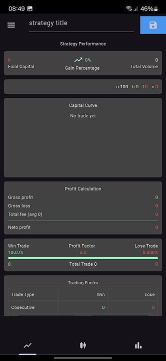
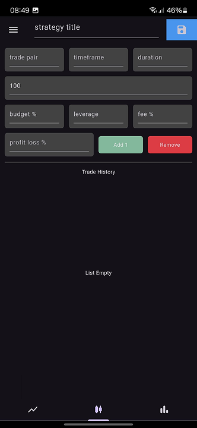
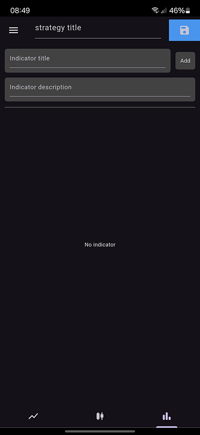

# Simple Trading Strategy Tester

This application is used to store the performance of a trading strategy, by storing trading data that has been done.
Users can store trading data by entering data such as profit per trade.

## Features

- Store trading data
- Delete trading data
- Display trading data
- Calculate trading performance
    - Final Capital
    - Gain Percentage
    - Capital Curve
    - Gross Profit
    - Total Fee 
    - Net Profit
    - Win Rate

# Download

Via Release Page: 

Via Play Store: 